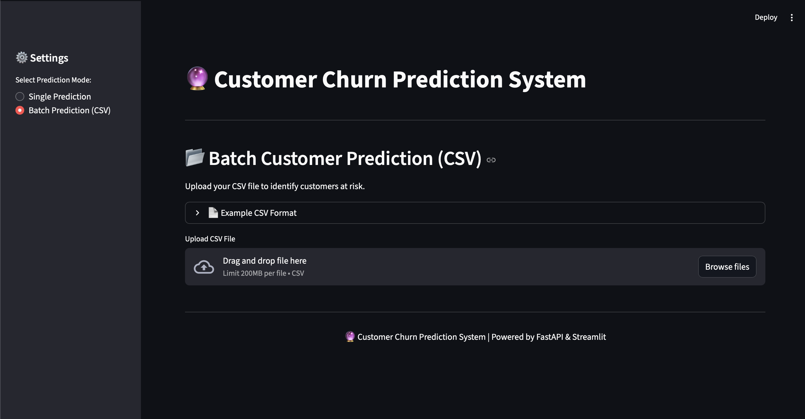
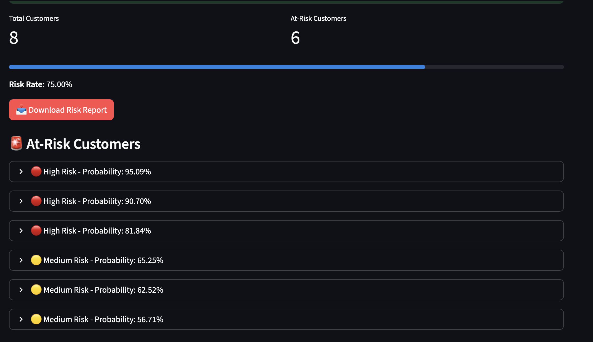

# 🔮 Customer Churn Prediction System

A full-stack machine learning application for predicting customer churn using CatBoost, FastAPI, and Streamlit.

## 📋 Project Structure

```
ChurnProject/
├── backend/              # FastAPI backend server
│   ├── app.py           # API endpoints
│   ├── final_model.pkl  # Trained ML model
│   └── requirements.txt # Backend dependencies
├── frontend/            # Streamlit web interface
│   ├── main.py         # Streamlit app
│   ├── assets/         # Example CSV files
│   └── requirements.txt # Frontend dependencies
├── notebooks/           # Jupyter notebooks
│   └── train_model.ipynb # Model training & evaluation
├── data/               # Dataset
│   └── Customer-Churn.csv
└── screenshots/        # Application screenshots
    ├── anasayfa.png
    └── raporekrani.png
```

## 🚀 Features

- **Single Customer Prediction**: Predict churn risk for individual customers
- **Batch Prediction**: Upload CSV files to analyze multiple customers
- **Risk Analysis**: Color-coded risk levels (High/Medium/Low)
- **Detailed Reports**: Download at-risk customer reports
- **Interactive Dashboard**: Beautiful Streamlit interface

## 📸 Screenshots

### Main Dashboard


### Risk Report


## 📊 Model Performance

- **Algorithm**: CatBoost Classifier (Optimized with Optuna)
- **Features**: 19 customer attributes (demographics, services, billing)
- **Preprocessing**: OneHotEncoder + OrdinalEncoder + StandardScaler
- **Hyperparameter Tuning**: Optuna (20 trials, F1-score optimization)
- **Evaluation Metrics**: Accuracy, F1 Score, Precision, ROC AUC

## 🛠️ Installation

### Prerequisites

- Python 3.13+
- pip

### 1. Clone the Repository

```bash
git clone <your-repo-url>
cd ChurnProject
```

### 2. Create Virtual Environment

```bash
python -m venv venv
source venv/bin/activate  # On macOS/Linux
# venv\Scripts\activate   # On Windows
```

### 3. Install Dependencies

**Backend:**
```bash
cd backend
pip install -r requirements.txt
```

**Frontend:**
```bash
cd ../frontend
pip install -r requirements.txt
```

## 🎯 Usage

### 1. Start Backend Server

```bash
cd backend
python -m uvicorn app:app --reload
```

Backend will run on: `http://127.0.0.1:8000`

### 2. Start Frontend (New Terminal)

```bash
cd frontend
streamlit run main.py
```

Frontend will open in your browser: `http://localhost:8501`

### 3. Make Predictions

**Single Prediction:**
1. Select "Single Prediction" mode
2. Fill in customer details
3. Click "Predict"

**Batch Prediction:**
1. Select "Batch Prediction (CSV)" mode
2. Download example CSV or upload your own
3. Click "Run Batch Prediction"
4. Download risk report

## 📝 CSV Format

Your CSV file should contain these columns:

```
gender,SeniorCitizen,Partner,Dependents,tenure,PhoneService,
MultipleLines,InternetService,OnlineSecurity,OnlineBackup,
DeviceProtection,TechSupport,StreamingTV,StreamingMovies,
Contract,PaperlessBilling,PaymentMethod,MonthlyCharges,TotalCharges
```

**Example:**
```csv
Male,0,Yes,No,12,Yes,No,DSL,Yes,Yes,No,No,No,No,Month-to-month,Yes,Electronic check,70.5,840.0
```

## 🔧 API Endpoints

### GET `/`
Health check endpoint

### POST `/predict`
Single customer prediction

**Request Body:**
```json
{
  "gender": "Male",
  "SeniorCitizen": 0,
  "Partner": "Yes",
  "tenure": 12,
  ...
}
```

**Response:**
```json
{
  "prediction": "WILL STAY",
  "probability": 0.23
}
```

### POST `/predict-batch`
Batch prediction from CSV file

**Request:** Multipart form data with CSV file

**Response:** CSV file with at-risk customers

## 🧠 Model Training

To retrain the model:

1. Open `notebooks/train_model.ipynb`
2. Run all cells
3. Model will be saved to `backend/final_model.pkl`

**Training Steps:**
- Data preprocessing (encoding, scaling)
- Model comparison (10+ algorithms)
- Hyperparameter tuning with Optuna (20 trials)
- F1-Score and ROC AUC evaluation
- Model persistence (joblib)

## 📦 Dependencies

### Backend
- **ML**: scikit-learn, catboost, xgboost, lightgbm
- **API**: fastapi, uvicorn, pydantic
- **Data**: pandas, numpy, scipy

### Frontend
- **UI**: streamlit
- **Data**: pandas, requests

## 🎨 Risk Categories

- 🔴 **High Risk** (>70%): Immediate action required
- 🟡 **Medium Risk** (50-70%): Consider retention strategies
- 🟢 **Low Risk** (<50%): Customer appears loyal

## 🐛 Troubleshooting

### Backend won't start
- Make sure port 8000 is available
- Check if all dependencies are installed
- Verify `final_model.pkl` exists

### Frontend can't connect
- Ensure backend is running on `http://127.0.0.1:8000`
- Check firewall settings

### Model loading error
- Retrain model using the same scikit-learn version (1.5.2)
- Check Python version compatibility

## 📄 License

This project is for educational purposes.

## 🤝 Contributing

Contributions are welcome! Please open an issue or submit a pull request.

## 📧 Contact

For questions or feedback, please contact the project maintainer.

---

**Powered by:** FastAPI 🚀 | Streamlit 🎨 | CatBoost 🐱 | scikit-learn 🔬
